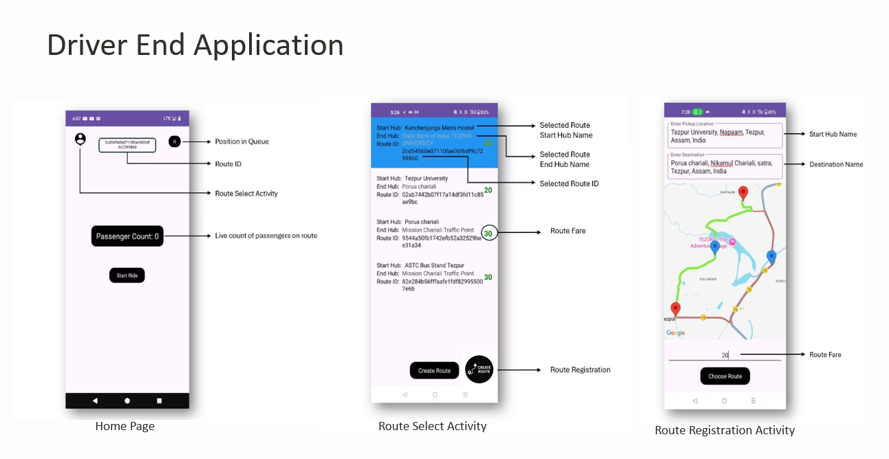
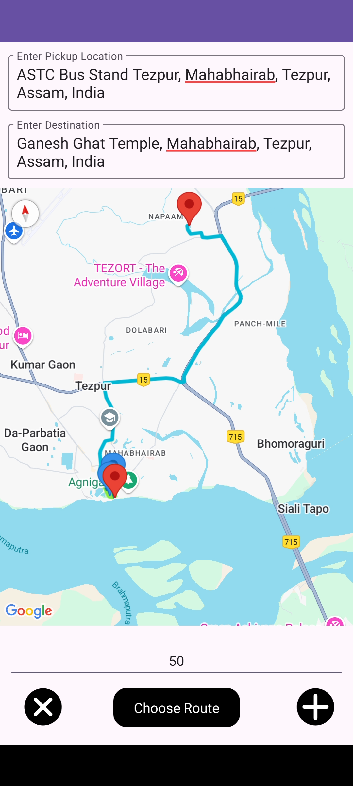
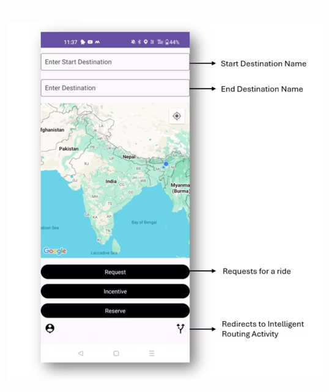
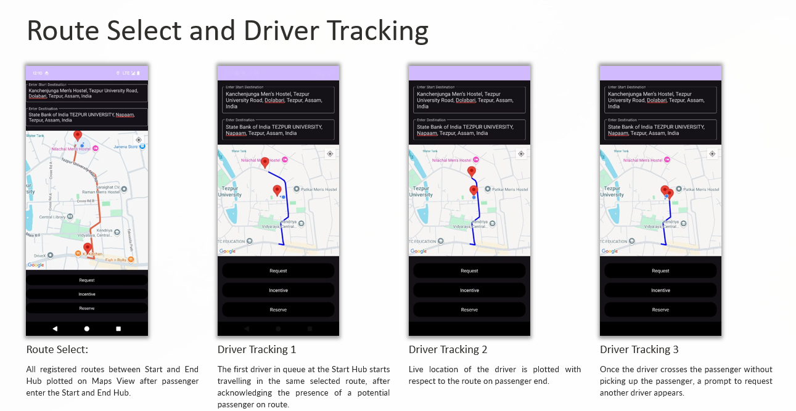
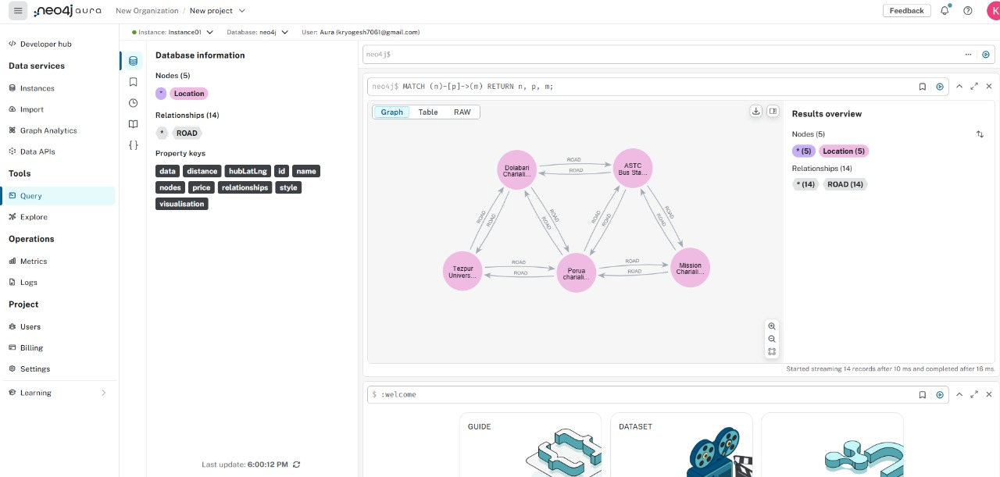
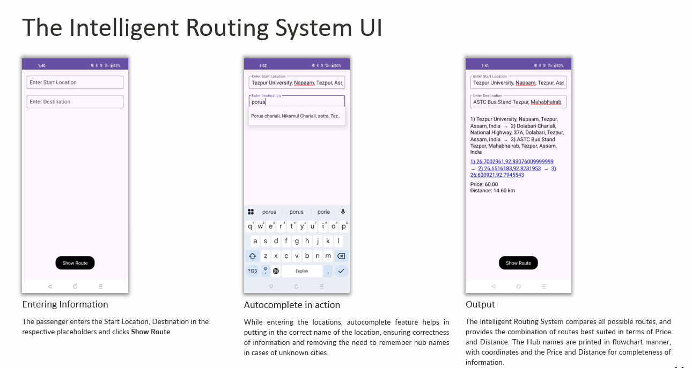

# 🚍 TransitSync: A Unified Public Transport Virtual System

> A standard for **virtualization and optimization** of public transport systems — enabling **real-time communication** between passengers and public transport entities like autos, e-rickshaws, and buses.

What if there was a unified platform for public transport entities, where passengers could track the buses and Rickshaws, drivers could know where passengers are,a more efficient platform connecting both. What if one could go to any city and get exact outline on how to change hubs/chowks take different modes of transport to reach from one point to another,GO to 
start-(pick rickshaw)->rajiv Chowk->Minakshi bazar->Anand chowk-(pick a bus)->paltan bazar-(pick a Rickshaw)->destination with total_cost-> 80 RS
📁 Refer to:
- [Intelligent Routing UI](./FieldTest&UI/Intelligent_Routing_UI.png)
- [Intelligent Routing System](https://drive.google.com/file/d/1BPSoKtLb5-AaoxOGHyjKPCQKRrlcMHpk/view?usp=drive_link)

There are no Current modern day Software Technologies working in the field of public Transport.  
**This Project Aims to Establish a standard for Virtualization and optimization of public Transport Systems.**  
📁 Refer to:
- [Current System Design](./FieldTest&UI/Current_System_Design_SVG.svg)
- [System_Design](./TransitSync_Architecture&Code/System_Design)
- [Project Report](./Project_Report.pdf)


## 🚀 What Makes TransitSync Different?

This is **not Ola or Uber**. It doesn't work on the **"pick up from anywhere"** model.  
Instead, it works on **established public transport routes**, dynamically updated by drivers or transport authorities through **Route Registration**.

📁 Refer to:
- [Route Registration (Driver App)](./FieldTest&UI/DriverEnd_Application_TransitSyncDriver.png))


## 🧠 Core Vision

> "But if i wait 10 minutes i will get an auto or a bus" - This is not the beauty of our Public transport system nor a testament for its efficiency rather the inverse. If one picks up a Auto today and roams around / moves in a route will inevitably pick up passengers due to high population density in India. And that is exactly what e-Rickshaws /autos do causing congestion and chaos in traffic.
In high-density countries like India, this chaotic wait-and-hope system leads to:
- Congestion  
- Idle time for drivers  
- Passenger inconvenience  

TransitSync **closes the communication gap** between driver and passenger, optimizing movement, reducing congestion, and increasing efficiency.

This Virtual System aims to fulfill the communication gap between the passenger and the driver in a public transport commute, Optimizing it and reducing the public transport entities making the system more efficient and not a pain in the back.

This project is based on the standard observation that public transport entities move like freight trains from one hub/Chowk to another hub/Chowk to and forth.  
Passing through same paths [Lat and Lng] over and over again. If We could virtualize this system it would serve as a base for communication, tracking and hub network Optimization.  

📁 Refer to:
- [Virtualization of Public Transport Hubs](https://drive.google.com/file/d/1BPSoKtLb5-AaoxOGHyjKPCQKRrlcMHpk/view?usp=drive_link)

Let's Classify and understand the Segregation of entities:  
1) AutoRickshaw/E-Rickshaw: - Current system has a unsaid rule that at chowks/hubs the auto driver that comes first loads up all the passengers first and then when the auto is full they move,  
and so follows for the others auto rickshaw driver in the queue as well.

But what if the auto Drivers knew that there are customers ahead in the route.  
He could stop wasting time waiting for passengers to load up at the hub and move in expectation of picking up passengers up ahead reducing waiting time for the driver and also increasing round trips. Also what if the passengers on the route could track the drivers on the route. This frees up the hubs, reducing congestion and also streamlines the process of Picking up passengers.

The next Driver moves to first Position in queue and is now shown the the live passengers on the route, based on which the driver can make his decision to wait or move.

This idea Might seem simple but this opens up doors to far more interesting ideas and implementations which i came through and established in this project.  
Discussed thoroughly in WorkFlow and Explanation
📁 Refer to:
- [Work Flow and Explanantion](https://drive.google.com/file/d/1o0ICIb8hbPJLTMZ-J83LntaHy5AIU3Sg/view?usp=drive_link)

2) Buses: Moving in a fixed route these public transport entities are essential especially in metropolitan cities for carrying passengers from one point to other. Passengers wait for buses not exactly knowing when it will come and many a times to dismay the bus is too crowded to be boarded which leads one to book a cab.

But what if the passenger could track it, could know how many passengers are already in the Bus, book tickets online from one stop to other eliminating the redundancy of Ticket checkers.  
To the already established architecture if a IoT device with unique QR code is added where the IoT device could send the location of bus to the server for tracking by the passengers and the QR code on login could serve for Route Registration for the driver/governing authority linking the route to the bus/IoT device fixed on the bus and same QR behind every seat on the bus could serve as portal for ticket booking from one station to other for the passengers.

3) Any other entities: The Virtual architecture is very much open to all kinds of vehicles and entities, and provides scope for further additions.

The prototype of the project in it self is huge, its actual implementation encompassing future scopes is indeed a formidable task. The unified public transport Virtual System  
would be a work of art and a technological marvel if implemented.

## 🔑 Key Features

---

### 🚦 Driver-Side Functionality

#### 🛣️ Route Registration Workflow
<p align="center">
  
</p>

#### 📱 Complex Route Registration
<p align="center">
  
</p>

---

### 👤 Passenger-Side Functionality

#### 🧭 Passenger Application UI
<p align="center">
  
</p>

#### 📍 Live Driver Tracking Interface
<p align="center">
  
</p>

---

### 🧭 Intelligent Routing System

#### 🗃️ Graph Database View
<p align="center">
  
</p>

#### 🗺️ Routing Workflow UI
<p align="center">
  
</p>
## 📘 Learn More
The further Explanation and understanding of the project can be inferred from TransitSync_Architecture&Code/workFlow&Explanation as a introductory text file doesn't do justice to complicated nuances of the project. One can also,
refer to ./Project Report and FieldTest&UI for visual understanding (only for Autos, Buses are future Implementation).

📁 Refer to:
- [Project Report](https://drive.google.com/file/d/1dcd7buucAV7AnF3mSWxGRZk9LmbbfXQx/view?usp=drive_link)
- [Field Test for Visual Understanding(only for Autos, Buses are future Implementation)](./FieldTest&UI)
- [Work Flow](https://drive.google.com/file/d/1o0ICIb8hbPJLTMZ-J83LntaHy5AIU3Sg/view?usp=drive_link)
- [Flow Chart](./TransitSync_Architecture&Code/FlowChart.svg)

## 📫 Contact

For questions, contact:  
📧 **kryogesh7061@gmail.com** 

## 📁 Project Structure

```plaintext
.
├── Project Report/
│   ├── 9. Virtualization of Public Transport Hubs.pdf
│   └── 10. The Intelligent Routing System.pdf
├── FieldTest&UI/
│   ├── IntelligentRouting.png
│   └── DriverEnd_Application_TransitSyncDriver
├── TransitSync_Architecture&Code/
│   ├── System_Design
│   └── workFlow&Explanation.pdf
